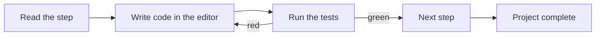

# Frontend Mastery — Learn by Building

An interactive platform for learning frontend engineering by **building real
projects**. Each project is a sequence of small, hands-on steps: you read what to
do, write the code in a live editor, run an automated test suite until it passes,
then move to the next step — carrying your code forward until you've built a
complete, working app.

Concepts are taught **in context**, while you build something — not as
disconnected drills.

## How it works



- **Live editor + preview** powered by [Sandpack](https://sandpack.codesandbox.io/).
- **Multi-step projects** — each step reveals after the previous one passes, and
  your code carries forward so the project builds up continuously.
- **Automated checks** — every step ships a hidden test suite. Green = done.
- **Reference solutions** per step, revealed on demand.
- **Progress and in-progress code** are saved locally (`localStorage`) — no
  account needed.

## Tracks

| Track | Status |
|-------|--------|
| React | ✅ Available — Project 1 · Tic-Tac-Toe (6 steps) |
| HTML, CSS, JavaScript, TypeScript, Testing, Accessibility, Performance | 🛣️ Planned |

The React track is project-based: **Project 1 (Tic-Tac-Toe)** teaches the
fundamentals; later projects cover forms & reducers, effects & data, custom
hooks, context, and more. See [docs/ROADMAP.md](docs/ROADMAP.md) for the full
project sequence.

## Run it

```bash
make install   # install dependencies
make dev       # start the dev server (alias: make run)
make build     # typecheck + production build
make lint      # lint
make verify    # validate every project step's tests
make check     # lint + build + verify
```

Run `make help` to list all targets. Prefer npm? The scripts are equivalent:
`npm install`, `npm run dev`, `npm run build`, `npm run lint`, `npm run verify:content`.

> The live editor uses Sandpack's hosted bundler, so an internet connection is
> needed to run/preview code (first compile takes ~10–20s).

## Project structure

```
src/
  content/
    tracks.ts              # track registry (available + planned)
    react/
      index.ts             # the React track definition
      tic-tac-toe.ts       # Project 1, authored as staged data
  components/
    CodePlayground.tsx     # Sandpack editor + preview + test runner
    Sidebar.tsx, Layout.tsx, Markdown.tsx, ui.tsx
  pages/
    HomePage, TrackPage, AssignmentPage, NotFound
  hooks/useProgress.ts     # localStorage-backed progress + stage tracking
  lib/codeStore.ts         # localStorage persistence of in-progress code
  types.ts                 # Assignment / Stage / Track content model
docs/ROADMAP.md
```

## Authoring a project

Add an `Assignment` with an ordered `stages` array (each stage: `brief`,
`starter`, `tests`, `solution`, `hints`). Each stage's `starter` is the previous
stage's `solution` (its checkpoint). Every stage's tests must **pass against that
stage's solution** and **fail against its starter** — verified by
`npm run verify:content`. Single-step assignments can still be authored with the
flat fields; `getStages()` normalizes both. No app changes needed unless a
different Sandpack template is required.
