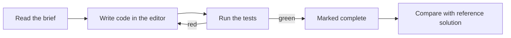

# Frontend Mastery — Learn by Building

An interactive platform for learning frontend engineering through **hands-on
assignments**. For each task you get a prompt, write code in a live editor, run
an automated test suite until it passes, then compare against a reference
solution.

It works like a school assignment tool: read the brief → solve it → verify →
learn from the solution.

## How it works



- **Live editor + preview** powered by [Sandpack](https://sandpack.codesandbox.io/).
- **Automated checks** — each assignment ships a hidden test suite. Green = done.
- **Reference solutions** revealed on demand (and loadable into the editor).
- **Progress** is saved locally (`localStorage`) — no account needed.

## Tracks

| Track | Status |
|-------|--------|
| React | ✅ Available (10 assignments) |
| HTML, CSS, JavaScript, TypeScript, Testing, Accessibility, Performance | 🛣️ Planned |

See [docs/ROADMAP.md](docs/ROADMAP.md) for the full plan and authoring order.

## Run it

```bash
make install   # install dependencies
make dev       # start the dev server (alias: make run)
make build     # typecheck + production build
make lint      # lint
make verify    # validate every assignment's tests
make check     # lint + build + verify
```

Run `make help` to list all targets. Prefer npm? The scripts are equivalent:
`npm install`, `npm run dev`, `npm run build`, `npm run lint`, `npm run verify:content`.

> The live editor uses Sandpack's hosted bundler, so an internet connection is
> needed to run/preview assignment code.

## Project structure

```
src/
  content/
    tracks.ts          # track registry (available + planned)
    react/index.ts     # the React track: all assignments live here as data
  components/
    CodePlayground.tsx # Sandpack editor + preview + test runner
    Sidebar.tsx, Layout.tsx, Markdown.tsx, ui.tsx
  pages/
    HomePage, TrackPage, AssignmentPage, NotFound
  hooks/useProgress.ts # localStorage-backed progress store
  types.ts             # Assignment / Track content model
docs/ROADMAP.md
```

## Authoring a new assignment

Add an `Assignment` object (brief, starter, tests, solution, hints) to a track's
array. Tests must **pass against the solution** and **fail against the starter**.
No app changes needed unless the track requires a different Sandpack template.
