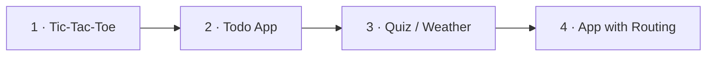

# Roadmap — Frontend Mastery Platform

The platform teaches by **building real projects**. A track is a sequence of
projects; each project is a multi-stage assignment that introduces concepts in
context, one small step at a time. There are no standalone "drill" exercises —
you learn a concept by using it to build something that works.

## Guiding principles

> Teach concepts inside projects, not in isolation. Each project ends in a
> tangible, working app. Later projects compound the skills of earlier ones.

> Prove the format on one project, then mass-produce content against a stable
> template.

Every project is one `Assignment` with an ordered list of `stages`:

| Piece | Purpose |
|-------|---------|
| `stages[]` | Ordered steps, revealed one at a time as each passes |
| `stage.brief` (Markdown) | Teaches the concept and states the step's task |
| `stage.starter` (file map) | A step's checkpoint (= previous step's solution) |
| `stage.tests` (file map) | Cumulative automated checks; green = step done |
| `stage.solution` (file map) | Reference solution through this step |
| `stage.hints` | Progressive nudges |

The student's code is **carried forward** between stages, so the whole project
builds a single artifact. Adding a project = adding one `Assignment` with stages;
no app changes needed unless a new Sandpack template is required.

## React track — project sequence

### Project 1 — Tic-Tac-Toe ✅ shipped

Fundamentals, from scratch. 6 stages: components & props → state & lifting state
up → turns → status & guards → derive a winner → reset.

**Concepts:** components, JSX, props & composition, `useState`, events, lists &
keys, lifting state up, conditional + derived state, immutable updates.

### Project 2 — Todo App (next)

A classic, building straight on Project 1's state skills.

**Concepts:** controlled inputs/forms, `useReducer`, add/remove/toggle items,
deriving filtered lists, persisting to `localStorage`.
**Likely stages:** render a static list → controlled "add" input → add via
reducer → toggle complete → delete → filter (all/active/done) → persist.

### Project 3 — Quiz / Weather (data & effects)

Introduces talking to the outside world.

**Concepts:** `useEffect`, data fetching & `async`/`await`, loading/error states,
custom hooks (e.g. `useFetch`), cleanup.
**Likely stages:** static question → answer & score → next/results → load
questions with `useEffect` → loading & error UI → extract a custom hook.

### Project 4+ — Larger app

**Concepts:** context & global state, client-side routing, `useMemo`/
`useCallback` & render performance, error boundaries, suspense, component
patterns (compound components, render props), and writing tests.

> Concept coverage check: Projects 1–3 cover everything the original standalone
> exercises did (props, state, lifting, lists, conditional/derived state,
> controlled forms, `useReducer`, `useEffect`, custom hooks) — each taught where
> it belongs in a real app — then Project 4+ extends into advanced territory.

## Other tracks (planned)

Same project-based model. Each becomes a short sequence of projects rather than a
list of drills.

| Track | Template | Example projects |
|-------|----------|------------------|
| HTML | `vanilla` | a semantic article page, an accessible form |
| CSS | `vanilla` | a responsive card layout, a pricing grid |
| JavaScript | `vanilla-ts` | a DOM to-do, a fetch-driven search |
| TypeScript | `vanilla-ts` | typing a small library, typing React props/hooks |
| Testing | `react-ts` | test-drive features against seeded bugs |
| Accessibility | `react-ts` | make an inaccessible widget accessible |
| Performance | `react-ts` | fix re-render and bundle problems |

## Future platform features (post-content)

Deferred until the curriculum has breadth. None block authoring.

- [ ] **Backend (optional):** account + cross-device progress sync. Today
      progress and in-progress code live in `localStorage`.
- [ ] **Content authoring DX:** a script to scaffold a new project file.
- [ ] **Side-by-side diff** of the student's code vs the step solution.
- [ ] **Per-project notes** the learner can keep.
- [ ] **Search** across tracks/projects.
- [ ] **Deploy:** the app is a static SPA — host on any static platform.

## Definition of done for a new project

1. One `Assignment` with an ordered `stages` array.
2. For every stage: its `tests` **pass** against that stage's `solution`.
3. For every stage: its `tests` **fail** against its `starter` (the previous
   stage's solution) — so each step gates on its new requirement.
4. Briefs teach the concept (not just state the task); hints are progressive.
5. Verified by `npm run verify:content` (checks every stage).
