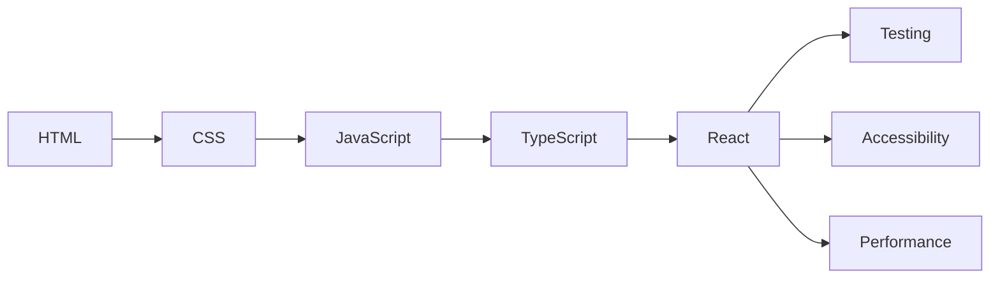

# Roadmap — Frontend Mastery Platform

This document is the plan for growing the platform from the **React track** (v1)
into a full hands-on frontend curriculum.

## Guiding principle

> Prove the format on one track, then mass-produce content against a stable
> template.

The React track is that template. Every assignment is a self-contained unit:

| Piece | Purpose |
|-------|---------|
| `brief` (Markdown) | The prompt/question the learner solves |
| `learningObjectives` | What the learner should walk away knowing |
| `starter` (file map) | Code the learner begins from |
| `tests` (file map) | Automated checks; green = done |
| `solution` (file map) | Reference solution, revealed on demand |
| `hints` | Progressive nudges |

Adding a track = adding a `Track` object with an array of these. No app changes
required unless a track needs a new Sandpack template (e.g. `vanilla` for
HTML/CSS/JS).

## Authoring order

Tracks are ordered to match a realistic learning path. Each builds on the last.

> Note: React shipped first (v1) to validate the platform, even though in the
> learning path it sits after the fundamentals. The fundamentals tracks below are
> authored next so the path reads top-to-bottom.

## Track plan

Each track targets **8–12 assignments**, intro → hard.

### 1. HTML

- Sandpack template: `vanilla` (or `static`)
- Checks: parse rendered DOM and assert structure/roles via testing-library
- Topics: document structure, semantic elements, links & images, lists, tables,
  forms & inputs, labels & `for`, landmarks, metadata/SEO basics

### 2. CSS

- Template: `vanilla`
- Checks: assert computed styles / layout via the preview DOM, plus visual briefs
- Topics: selectors & specificity, box model, units, flexbox, grid, positioning,
  responsive design & media queries, transitions, a small layout build

### 3. JavaScript

- Template: `vanilla-ts` (types stripped) or `vanilla`
- Checks: pure unit tests on exported functions
- Topics: variables & scope, functions & closures, arrays (`map`/`filter`/
  `reduce`), objects & destructuring, the DOM API, events, fetch & promises,
  `async`/`await`, modules

### 4. TypeScript

- Template: `vanilla-ts`
- Checks: unit tests + type-level assertions (`expect-type` style helpers)
- Topics: primitives & inference, unions & narrowing, interfaces vs types,
  generics, utility types, typing functions, typing React props/hooks

### 5. React (shipped — v1)

- Template: `react-ts`
- 10 assignments: first component, props, `useState`, conditional rendering,
  lists & keys, controlled forms, lifting state, `useEffect`, custom hooks,
  `useReducer`
- **Next additions:** context, `useMemo`/`useCallback`, refs & the DOM, data
  fetching patterns, error boundaries, suspense

### 6. Testing

- Template: `react-ts`
- Checks: meta — the learner writes the tests; we assert their tests catch
  seeded bugs
- Topics: testing-library queries, user events, mocking, async assertions,
  integration tests, intro to E2E concepts

### 7. Accessibility

- Template: `react-ts`
- Checks: role/name/label assertions, keyboard interaction, `axe` smoke checks
- Topics: semantic HTML wins, ARIA roles/states, focus management, keyboard nav,
  forms & errors, color contrast, accessible components

### 8. Performance

- Template: `react-ts`
- Checks: render-count assertions, memoization correctness, bundle reasoning
- Topics: avoiding re-renders, memoization, list virtualization concepts,
  code-splitting, measuring with the Profiler, Core Web Vitals literacy

## Future platform features (post-content)

These are deferred until the curriculum has breadth. None block authoring.

- [ ] **Backend (optional):** account + cross-device progress sync. Today
      progress lives in `localStorage`; a thin API + DB would sync it. Keep the
      content as files either way.
- [ ] **Content authoring DX:** a script/CLI to scaffold a new assignment file.
- [ ] **Multi-file diff view** for solutions (side-by-side starter vs solution).
- [ ] **Per-assignment notes** the learner can keep.
- [ ] **Search** across tracks/assignments.
- [ ] **Streaks / XP** lightweight gamification (only if it aids motivation).
- [ ] **Deploy:** the app is a static SPA — host on any static platform.

## Definition of done for a new track

1. `Track` object authored with 8–12 assignments.
2. Every assignment's tests pass against its own `solution`.
3. Every assignment's tests **fail** against its `starter` (so they're real).
4. Briefs reviewed for clarity; hints are progressive.
5. Track flipped from `planned` to `available` in `src/content/tracks.ts`.
